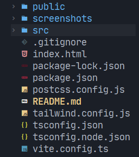
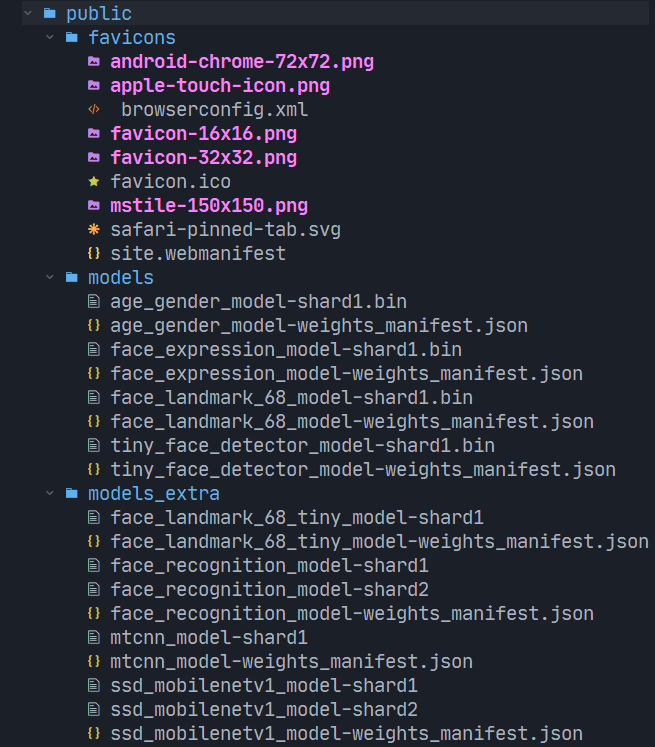

<h1 align="center">
    
    <a href="https://github.com/Eessh/beverage-recommendation-system/tree/recommendation_using_only_emotion">
        <span valign="middle">
                Beverage Recommendation System
        </span>
    </a>
</h1>

Recommends beverages based on age, gender, emotion, weather, and some other parameters.

> Data Collector: https://github.com/Eessh/beverage-recommendation-system-data-collector

Currently, this app was using only `emotions` for recommending beverages. We could also use `age, gender, weather, temperature` parameters for recommending beverages, we just need to enable them in the source code.


## User Flow


## Data Flow


## Navigation through source code
- Project Root
  - 
  - Consists of two main folders: `public, src`.
  - The `screenshots` folder is just to show these screenshots in README.
- Public Folder
  - 
  - Consists `favicons, models, models_extra`.
  - `favicons` contains all of required images, svgs, favicons for the browser to show our icon on the tab.
  - `models` contains all required models for face emotion recognition.
  - `models_extra` are useless models.
- Source Folder
  - 
  - Consists `assets, components, RecommendationSystem, TaggingSystem`.
  - `assets` consists all the required images, icons for this app.
  - `components` consists the basic building blocks(components) for all pages.
  - `RecommendationSystem` consists data related to how recommendations work.
  - `TaggingSystem` consists of beverages data, tags.
- Assets Folder
  - 
  - `images` folder consists images of beverages seperated to folders by their tags.
  - `icons` consists all icons used in this app, all of these icons are exported in `index.ts`.
- Components Folder
  - 
  - `AnalysisResults` component shows the emotion predicted in the `VideoComponent`.
  - `Animated` folder consists of components which have some animations, all of the components are made with `Framer Motion` library.
  - `BeverageCard` is the card which holds, beverage image, name, price. When cicked, this will trigger `ViewmorePopup` component to show more data about the clicked beverage.
  - `BeverageTagHandler` is the vertical side bar in the left, in `Recommendations` component. It shows the recommended tags for the user. When clicked upon a tag, it will set the tag as active tag in `GlobalContext`, which will trigger the `BeveragesVieHandler` component to show beverages of tag, that was clicked.
  - `BeveragesViewHandler` fetches and shows, all beverages withe the tag as active tag in `GlobalContext`.
  - `LaunchScreen` this is the home page of this app, from which we can directly jump into the app by clicking `Get Started` button or, we could go to settings by clicking `Settings Icon` in top right.
  - `pages` contains `Beverages, Cart, Home, Payment` components.
  - `Beverages` page(essentially a component) combines `BeverageTagHandler, BeverageViewHandler` components. Here user can add beverages to cart.
  - `Cart` page(essentially a component) shows the beverages in added to cart. Here user can remove the beverages he doesn't like.
  - `Home` page(essentially a component) is the starting page for Vending Machine UI, it's not useful now ;)
  - `Payment` page(essentially a component) shows uses the total cost of all drinks bought. When user clicks on pay button, payment processing is done (fake payment), after that, the transaction details (age, gender, emotion, beverages bought, recommended beverages) are added to databse by a POST request to Data Collector.
  - `QuantityHandler` component function is to handle the quantity of beverages, it is used in `ViewMorePopup`.
  - `Recommendations` page(essentially a component), internally reuses the `Beverages` component, but with recommended tags.
  - `RecommendationsPrompt` component is just a prompt, asking whether the user would like to see recommended products or not. This is part of Vending Machine UI. It's currently not used.
  - `RemovableBeverageCard` component is just a `BeverageCard` with a remove button attached. It is used in the `Cart` page(essentially a component), where user could remove the beverages he doesn't like.
  - `SettingsScreen` component, helps management to change the way this app recommends beverages to users. Management could toggle the recommended tags on-off for each emotion. If a recommended tag is on for an emotion, the app will recommend beverages with that tag for the emotion, else it wouldn't recommend beverages with that tag.
  - `VideoComponent`, this is where the AI functionality lives in (FaceAPI.js). This component actually acts as a page (/detectionScreen path). This component predicts user emotion and stores it in `GlobalContext`.
  - `ViewMorePopup` component shows more information about a beverage, this component will be shown when the user clicks a beverage card. This is where the user can add a bevrage to cart.
- Recommendation System
  - 
  - `AgeGenderData` consists of recommended tags for each gender and age range.
  - `EmotionsData` consists of recommended tags for each emotion.
  - `EmotionWeights` consists of weights for each emotion. This helps us in predicting more acccurate emotion in `VideoComponent`.
  - `TemperatureData` consists of recommended tags for each temeprature range.
  - `WeatherData` consists of recommended tags for each weather type.
  - `RecommendationSystem` provides utility functions for getting recommended tags for each paramater (`age, gender, emotion, weather, temperature`). Utility Functions:
    - Age & Gender - `ageGenderRecommendations(gender: string | undefined, age: number | undefined) => TTags`
    - Emotions - `emotionRecommendations(emotions: TEmotions, currentEmotionsData: TEmotionsData) => TTags`
    - Weather - `weatherRecommendations(weatherCode: number) => TTags`
    - Temperature - `temperatureRecommendations(temperature: number) => TTags`
- Tagging System
  - 
  - `BeveragesData` consists of all beverages data. Example:
    ```
    const BeveragesData = [
      {
        name: "CocaCola",
        description: "Such a good drink, should try it :)",
        price: 1.35,
        quantityAvailable: 21,
        tags: ["Carbonated Drinks", "Cool Drinks"],
        imgSrc: CocaCola,
        imgAlt: ""
      },
      {...},
      ...
    ];
    ```
  - `Tags` consists of all tags used in `BeveragesData`.
  - `Utils` consists of utility functions provided by tagging system, Examples:
    - Get all beverages with tag - `getBeveragesForTag(tag: string) => TBeverages`
    - Get beverage by name - `getBeverageByName(name: string) => TBeverage`

## To run on local server
```bash
git clone -b recommendation_using_only_emotion https://github.com/Eessh/beverage-recommendation-system.git
cd beverage-recommendation-system/
npm install
npm run dev
```
