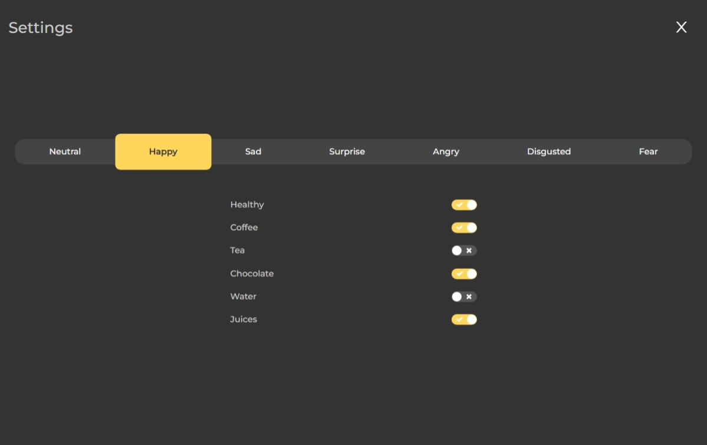

<h1 align="center">
    
    <a href="https://github.com/Eessh/beverage-recommendation-system/tree/recommendation_using_only_emotion">
        <span valign="middle">
                Beverage Recommendation System
        </span>
    </a>
</h1>

Recommends beverages based on age, gender, emotion, weather, and some other parameters.

> Data Collector: https://github.com/Eessh/beverage-recommendation-system-data-collector

Currently, this app was using only `emotions` for recommending beverages. We could also use `age, gender, weather, temperature` parameters for recommending beverages, we just need to enable them in the source code.





## User Flow


## Data Flow


## To run on local server
```bash
git clone -b recommendation_using_only_emotion https://github.com/Eessh/beverage-recommendation-system.git
cd beverage-recommendation-system/
npm install
npm run dev
```
